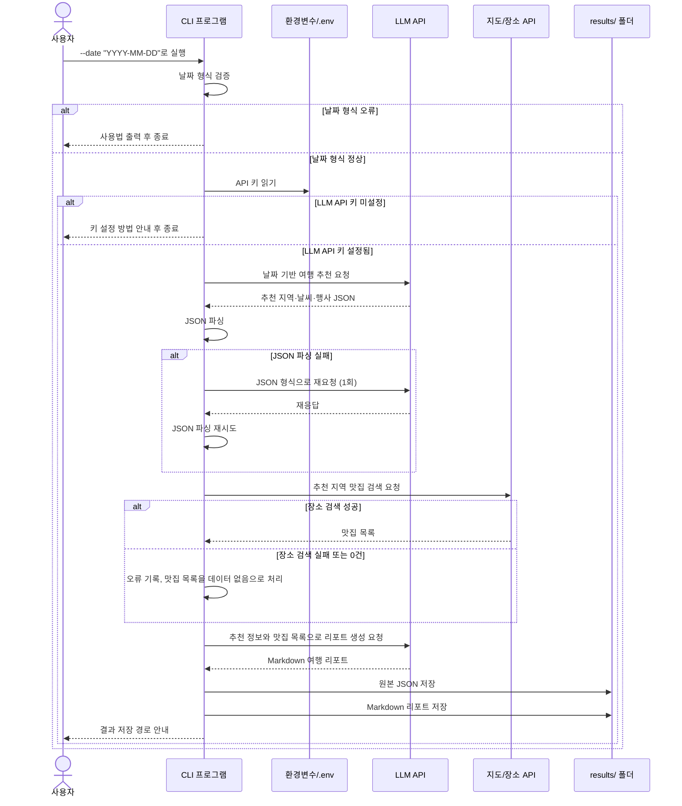

# 국내 여행 추천 프로그램 흐름

## 전체 흐름

```text
사용자 실행
    ↓
날짜 입력값 검증
    ↓
API 키 확인
    ↓
LLM으로 여행 지역·날씨·행사 추천 생성
    ↓
LLM 응답 JSON 파싱
    ↓
지도/장소 API로 추천 지역 맛집 검색
    ↓
LLM으로 최종 여행 리포트 생성
    ↓
원본 JSON과 Markdown 리포트 저장
    ↓
저장 경로 안내 후 종료
```

## 시퀀스 다이어그램



## 1. 프로그램 실행과 날짜 검증

사용자는 터미널에서 날짜를 포함해 프로그램을 실행한다.

```bash
python travel_planner.py --date "2026-09-15"
```

`argparse`로 `-date` 또는 `--date` 값을 받는다. 날짜가 없거나 `YYYY-MM-DD` 형식이 아니면 사용법을 출력하고 프로그램을 종료한다.

## 2. API 키 확인

환경변수 또는 `.env` 파일에서 LLM API 키와 지도/장소 API 키를 읽는다.

- LLM API 키가 없으면 설정 방법을 안내하고 즉시 종료한다.
- 지도/장소 API 키가 없거나 사용할 수 없으면 오류 목록에 기록한다.
- 지도/장소 API 오류가 있어도 리포트 생성 단계는 계속 진행한다.

## 3. 1차 여행 추천 생성

입력한 날짜를 LLM에 전달해 여행하기 좋은 국내 지역, 일반적인 날씨, 행사·축제 후보, 추천 근거를 요청한다.

LLM 응답은 다음 키를 가진 JSON으로 파싱한다.

```json
{
  "recommended_city": "제주",
  "weather": "해당 시기 일반적 날씨 요약",
  "events": ["행사 또는 축제 후보"],
  "reason": "추천 근거"
}
```

JSON 파싱에 실패하면 JSON만 다시 출력하도록 프롬프트를 수정해 1회 재시도한다. 재시도 후에도 실패하면 오류를 기록하고 안전하게 종료하거나, 구현한 대체 정책에 따라 리포트 생성을 진행한다.

## 4. 맛집 검색

1차 추천 JSON의 `recommended_city`를 검색어로 사용해 Kakao Local 또는 Naver Local Search API에서 맛집을 검색한다.

각 맛집은 가능한 범위에서 다음 정보를 정리한다.

- 이름
- 주소
- 카테고리
- 장소 URL
- 좌표

검색 결과가 없거나 API 호출에 실패하면 프로그램을 중단하지 않는다. 맛집 목록은 빈 리스트로 두고 오류 내용을 `errors` 목록에 기록한다.

## 5. 최종 여행 리포트 생성

1차 추천 결과와 맛집 목록을 LLM에 전달해 Markdown 형식의 여행 리포트를 만든다.

리포트에는 다음 내용을 포함한다.

- 추천 지역과 추천 이유
- 날씨 요약
- 행사·축제 목록
- 맛집 추천 목록
- 1일 일정 제안
- 오류 요약

맛집 데이터가 없으면 맛집 섹션에 `데이터 없음`으로 표시한다.

## 6. 결과 저장

`results/` 폴더가 없으면 생성한 뒤, 입력 날짜를 파일명에 사용해 결과를 저장한다.

```text
results/
├── 2026-09-15_raw_data.json
└── 2026-09-15_travel_plan.md
```

원본 JSON 파일에는 다음 데이터를 저장한다.

- 1차 추천 JSON
- 맛집 검색 결과
- 오류 요약 목록

최종 리포트는 Markdown 파일로 저장한다.

## 오류 처리 흐름

| 상황 | 처리 방법 | 리포트 생성 |
| --- | --- | --- |
| 날짜 형식 오류 | 사용법 출력 후 종료 | 진행하지 않음 |
| LLM API 키 미설정 | 설정 방법 안내 후 종료 | 진행하지 않음 |
| LLM JSON 파싱 실패 | 프롬프트 수정 후 1회 재시도 | 구현 정책에 따름 |
| 장소 API 인증·네트워크·쿼터 오류 | 오류 기록, 맛집 목록을 비움 | 계속 진행 |
| 장소 검색 결과 0건 | 오류 기록, 맛집을 데이터 없음으로 표시 | 계속 진행 |

## 완료 메시지

모든 결과를 저장한 뒤, 사용자에게 최종 리포트의 저장 경로를 안내한다.

```text
완료! results/2026-09-15_travel_plan.md 를 확인하세요.
```
