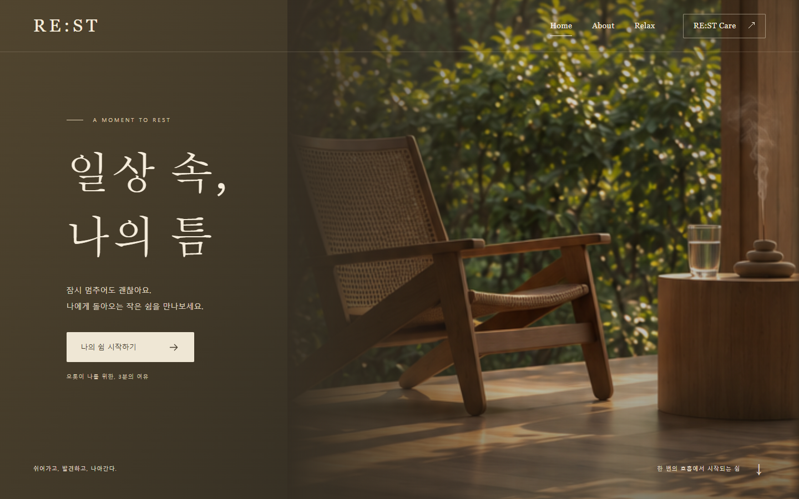
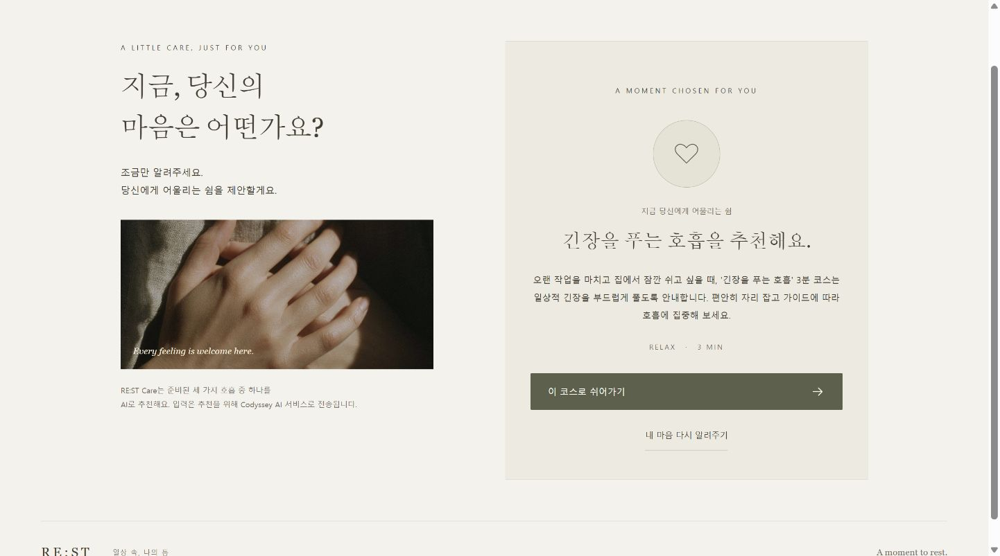
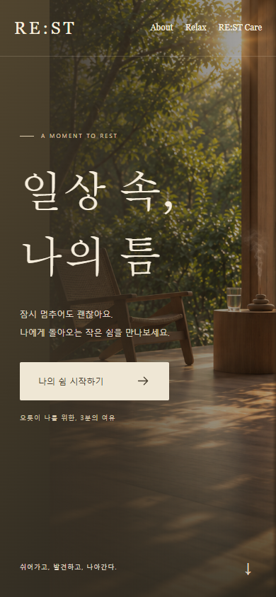
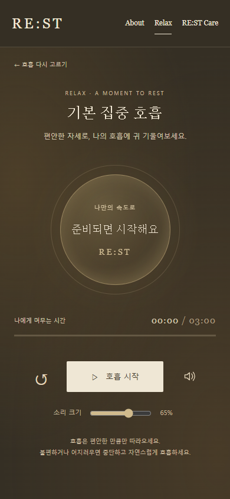

# RE:ST — 일상 속, 나의 틈

**A moment to rest. 쉬어가고, 발견하고, 나아간다.**

RE:ST는 숨가쁜 일상 속에서 나에게 필요한 쉼을 발견하고, 3분의 호흡으로 쉬어가는 웹 서비스입니다. 연령·성별·직업에 관계없이 잠깐의 휴식이 필요한 모두를 위한 서비스입니다.

[서비스 이용하기](https://codyssey-theta.vercel.app/)

## 주요 화면

### 첫 만남 — Home (PC)

따뜻한 오후 빛을 담은 첫 화면에서 나를 위한 짧은 쉼을 시작합니다.



### 내게 맞는 쉼 — RE:ST Care (PC)

현재 환경·상황·필요한 도움을 알려주면, AI가 준비된 세 가지 호흡 중 하나와 추천 이유를 제안합니다. 이 코스로 쉬어가기’를 누르면 추천된 코스가 선택됩니다.



### 손안의 3분 — Home과 호흡 플레이어 (MO)

원하는 호흡을 직접 고른 뒤, 시작 버튼을 눌러 음악과 호흡 가이드를 따라 쉬어갑니다. 플레이어에서 일시정지·재개와 음량 조절을 할 수 있습니다.





모두 로컬 서비스의 실제 화면입니다. 플레이어는 시작 전 상태입니다. 전체 캡처와 검증 기록은 [증빙 자료](docs/evidence/README.md)에서 확인할 수 있습니다.

## 바로 실행하기

Python 3.12 이상이 있는 터미널에서:

```powershell
cd C:\Users\hwkim\Desktop\Codyssey\A1-3
python dev_server.py
```

[http://localhost:3000](http://localhost:3000)를 엽니다. Python 표준 라이브러리만 사용하므로 별도 패키지 설치는 없습니다. 종료는 `Ctrl+C`입니다.

3000번이 사용 중이면 `python dev_server.py --port 3001`을 실행합니다. `index.html` 더블 클릭이나 `python -m http.server`는 Python 추천 API를 제공하지 않으므로 전체 기능 실행에는 위 전용 서버를 사용합니다.

## 주요 기능

1. **Home → About:** 원본 이미지의 목재·자연·따뜻한 오후 빛을 유지한 인트로와 서비스 소개.
2. **Personal:** 기본 집중 호흡 / 편안한 수면 호흡 / 긴장을 푸는 호흡 중 직접 선택.
3. **호흡 플레이어:** 사용자 클릭 후 음악 시작, 일시정지·재개, 처음부터 재생, 음소거·음량, 3분 타이머와 완료 안내, 홈 이동.
4. **원형 호흡 가이드:** 편안한 4초 들이마시기·6초 내쉬기 제안. 속도를 강요하지 않고 애니메이션 감소 설정을 존중합니다.
5. **RE:ST Care:** 세 입력을 Python으로 보내 실제 Codyssey API를 호출하는 코드. 서버에서 허용된 세 코스만 검증하여 반환합니다.
6. **실패 처리:** 빈 입력, 길이 제한, 중복 요청, API 키 미설정, 4xx/5xx, 잘못된 AI 결과, 지연·취소·음악 로딩 오류 안내.
7. **접근성·반응형:** 키보드 메뉴·라디오 선택, 포커스 표시, 상태 안내, 모바일·태블릿·데스크톱 레이아웃.

현재 콘텐츠는 **Relax만** 제공합니다.

## 기술 스택

| 영역 | 사용 기술 |
| --- | --- |
| 화면 구조 | 순수 HTML |
| 디자인·반응형 | 순수 CSS, 제공된 사진, SVG 아이콘·배경 뷰포트 |
| 화면 이동·폼·플레이어 | Vanilla JavaScript, Fetch, HTML Audio, Web Audio |
| API | Python 3.12, `BaseHTTPRequestHandler`, `urllib.request` |
| AI | Codyssey OpenAI 호환 Chat Completions + 서버 JSON 검증, 기본 `gpt-5-mini` |
| 배포 | Vercel Python Functions, GitHub `main` 연동 |
| 검증 | Python `unittest`, Playwright + Chrome (개발 테스트 전용) |

React / Vue / Next.js 등 프론트엔드 프레임워크를 사용하지 않습니다. Node.js와 Playwright는 브라우저 자동 테스트를 다시 실행할 때만 필요하며 서비스 실행에는 필요하지 않습니다.

## 파일 구조

```text
A1-3/
├── index.html                화면·메뉴·입력 폼·플레이어
├── css/style.css             색상·레이아웃·반응형·호흡 원
├── js/app.js                 화면 이동·오디오·타이머·fetch
├── api/recommend.py          실제 Codyssey 호출·입출력 검증
├── audio/
│   ├── focus.mp3             제공된 원본의 복사본
│   ├── sleep.mp3
│   └── relax.mp3
├── images/favicon.svg
├── dev_server.py             로컬 화면과 같은 API 실행
├── requirements.txt          표준 라이브러리만 사용함을 명시
├── .python-version           3.12
├── vercel.json               배포·보안 헤더·함수 실행 시간
├── .vercelignore             로컬/증빙/원본 중복 업로드 제외
├── .gitignore                .env, 캐시, 개발 의존성 제외
├── .env.example              환경 변수 이름만 들어 있는 예시
├── tests/
│   ├── test_recommend.py     서버·HTTP·모델 응답 실패 테스트
│   ├── browser-check.cjs     반응형·폼·실제 음원·3분 테스트
│   └── browser-edge-check.cjs 키보드·보안·취소·음악 오류 검사
├── docs/
│   ├── service-plan.md       서비스 기획서
│   ├── setup-and-deploy.md   계정 설정과 배포 따라 하기
│   ├── learning-guide.md     코드 구조와 동작 설명
│   ├── assets.md             실제 사용 이미지·음원 목록
│   └── evidence/            스크린샷·검증 결과·개발 과정
└── 제공된 원본 이미지 9개와 음원 3개 (그대로 보존)
```

## 환경 변수

`.env.example`을 `.env`로 복사하고, 편집기에서 `OPENAI_API_KEY`의 값에 키를 직접 입력합니다. `OPENAI_MODEL`은 선택 사항이고 비워 두면 기본 모델을 사용합니다. 설정 후 로컬 서버를 재시작합니다.

| 변수 | 필수 | 의미 |
| --- | --- | --- |
| `OPENAI_API_KEY` | 실제 AI 추천에 필요 | 서버에서만 읽는 Codyssey API 키 (호환 변수명 유지) |
| `OPENAI_MODEL` | 선택 | Codyssey 콘솔에서 사용 가능한 CHAT 모델. 기본 `gpt-5-mini` |

실제 값을 소스·README·`.env.example`·스크린샷에 넣지 않습니다. `.env`는 Git과 배포에서 제외하고 로컬 HTTP 접근도 막습니다. Vercel에서는 `.env` 대신 프로젝트 환경 변수에 직접 설정합니다.

## AI 호출 구조

```text
사용자: 현재 환경 / 현재 상황 / 필요한 도움
  ↓
js/app.js: 필수값 확인 → JSON.stringify → fetch('/api/recommend', POST)
  ↓
api/recommend.py: JSON 파싱 → 필수값·길이 검사
  ↓
서버 환경 변수의 키 → https://copa.codyssey.kr/v1/chat/completions
  ↓
프롬프트로 JSON 요청: course_id는 focus / sleep / relax 중 하나, reason은 짧은 한국어
  ↓
Python: 실제 응답의 완료 상태·형식·ID·이유를 다시 검증
  ↓
브라우저: 코스·이유를 textContent로 표시 → 추천된 Relax 코스 선택
```

성공 응답의 형식 예시(설명용이며 실제 추천 증빙이 아닙니다):

```json
{
  "course_id": "relax",
  "course": "긴장을 푸는 호흡",
  "reason": "지금은 마음의 긴장을 천천히 내려놓는 시간이 어울려요."
}
```

API 키나 사용자 입력을 콘솔·서버 로그에 출력하지 않습니다. 로그에는 요청 식별자, HTTP 상태, 안전한 오류 코드만 남깁니다. 사용자 입력은 서버의 DB나 브라우저 저장소에 보관하지 않습니다. 추천 요청은 Codyssey AI 서비스로 전달됩니다. 제공자 측 보관 정책은 해당 서비스 정책을 따릅니다.

## 오류와 실패 처리

| 상황 | HTTP / 동작 | 화면 |
| --- | --- | --- |
| 빈 입력 | 브라우저에서 차단, 서버에서는 400 | ‘조금만 더 알려주시면…’ |
| 잘못된 JSON·타입·길이 | 400 | 입력 확인 안내 |
| 본문 4096바이트 초과 | 413 | 입력 줄이기 안내 |
| JSON 외 형식 | 415 | JSON 요청 안내 |
| POST 외 요청 | 405, `Allow: POST` | API 메서드 안내 |
| API 키 없음 | 503 `NOT_CONFIGURED` | 연결 준비 안내, Personal 링크 |
| AI 호출 제한 | 429, `Retry-After` | 연결 안내와 재시도 |
| AI 인증·네트워크·잘못된 응답 | 502 | ‘잠시 연결이 고요해졌어요…’ |
| AI 통신 대기 초과 | 504 | 지연 안내 |
| 예상 밖 서버 오류 | 500 | 민감정보 없는 일반 안내 |
| 프론트 요청 25초 초과 | AbortController 취소 | 지연 안내, 버튼 다시 활성화 |
| 화면 이동 중 응답 | 요청 취소와 응답 무시 | 다른 화면에 결과가 끼어들지 않음 |
| 사운드 실패 | 일시정지·재시도 | 사운드 연결 안내 |

음악 세션은 `performance.now()`의 시간 차이로 계산해 타이머 호출 간격에 따른 누적 오차를 줄입니다. 오디오 버퍼링 중에는 시계를 멈추고, Web Audio가 지원되는 경우 별도의 음량 종료 예약으로 백그라운드 탭에서도 종료 시각에 소리를 끕니다. 브라우저가 완전히 중단되면 화면의 완료 갱신은 탭이 다시 활성화될 때 실행될 수 있습니다.

## 테스트

### 실제 AI 추천 확인

1. [RE:ST Care](https://codyssey-theta.vercel.app/#care)를 엽니다.
2. 현재 환경은 `집`, 상황은 `오랜 작업을 마치고 잠깐 쉬고 싶어요.`, 필요한 도움은 `긴장을 내려놓고 싶어요.`로 입력합니다.
3. **나에게 맞는 쉼 찾기**를 누르고 로딩 후 코스명과 추천 이유가 나타나는지 확인합니다.
4. **이 코스로 쉬어가기**를 눌러 추천 코스가 선택된 상태로 이동하는지 확인합니다.
5. **이 호흡으로 시작하기 → 호흡 시작**을 눌러 음악·타이머를 확인합니다.

추천은 실행마다 달라질 수 있지만 코스는 `focus`, `sleep`, `relax` 중 하나여야 합니다. 필수 입력을 비운 채 요청하면 입력 안내가 표시되어야 합니다. 오류가 나면 아래 실패 처리 표와 [설정·문제 해결 안내](docs/setup-and-deploy.md)를 확인합니다. 로컬에서는 같은 과정을 `http://localhost:3000/#care`에서 실행합니다.

### 자동 테스트

서버 테스트(외부 AI 호출 없음):

```powershell
python -m unittest discover -s tests -p "test_*.py" -v
```

브라우저 자동 테스트를 직접 재실행하려면 Python 서버를 켜둔 상태에서 새 터미널을 열고 Node.js와 Chrome이 있는 환경에서:

```powershell
cd C:\Users\hwkim\Desktop\Codyssey\A1-3
npm install --no-save --package-lock=false playwright
node tests/browser-check.cjs --full-duration
node tests/browser-edge-check.cjs
```

브라우저 자동 테스트는 **API 키가 설정되지 않은 별도 로컬 서버**를 전제로 키 미설정 안내와 모의 응답을 검사합니다. 실제 AI가 연결된 공개 배포 주소에는 이 스크립트를 그대로 실행하지 않습니다.

기존 개발 환경에서는 번들 Playwright를 사용해 실행했고, 서비스에 npm 의존성을 추가하지 않았습니다. `--full-duration`을 빼면 실제 3분 대기를 생략합니다. 전체 실행 결과는 `browser-report.json`, 짧은 실행은 `browser-smoke-report.json`으로 기록합니다.

검증 결과:

- Python 테스트 **13개 통과**.
- 화면 **1440×900 / 768×1024 / 390×844 / 320×740**에서 메뉴·폼·플레이어 확인, 가로 넘침 없음.
- 세 MP3를 실제로 재생하고 일시정지·재개·화면 이동 시 정지 확인.
- **실제 180초 재생**하여 짧은 파일 반복, `03:00` 완료, 오디오 정지, 다시 시작 확인.
- 빈 입력·키 없음은 실제 로컬 API로 검증. HTTP 오류·지연·추천 성공 UI는 **테스트 전용 모의 응답**으로 검증.
- 로컬에서 Codyssey의 실제 AI 추천·결과 표시·코스 이동을 검증했습니다.
- 공개 Vercel 주소에서 세 음원 모두 HTTP 200과 `audio/mpeg` 응답을 확인했습니다(2026-09-11). 공개 사이트의 실제 AI 추천·메뉴·반응형·180초 완료를 포함한 전체 흐름은 추가 검증이 필요합니다.

스크린샷과 상세 기록은 [증빙 자료](docs/evidence/README.md)에 있습니다.

[4번 증빙 — AI 코딩 도구 사용 과정](docs/evidence/development-log.md)에는 실제 대화 발췌, API 연결 오류 수정, Computer Use 캡처 과정을 정리했습니다.

## 앞으로 확장할 기능

Refresh(6분 ASMR), Return(9분 명상), Archive, DB, 개인화 추천, 커머스. 모두 향후 계획이며 현재 동작하는 기능으로 표시하지 않았습니다.

## 학습 문서와 공식 참고

- [서비스 기획서](docs/service-plan.md)
- [실행·환경 변수·Vercel 배포 방법](docs/setup-and-deploy.md)
- [HTML·CSS·JavaScript·Python·Git 동작 설명](docs/learning-guide.md)
- [사용한 이미지·음원과 원본 보존](docs/assets.md)
- [Vercel Python `/api` 함수](https://vercel.com/docs/functions/runtimes/python/api-directory)
- [Vercel 환경 변수](https://vercel.com/docs/environment-variables)
- API 주소·호출 형식은 사용자가 제공한 Codyssey API 콘솔의 Chat Completions 예시를 따릅니다.
- 모델 목록은 사용자의 Codyssey API 콘솔에서 확인합니다.
