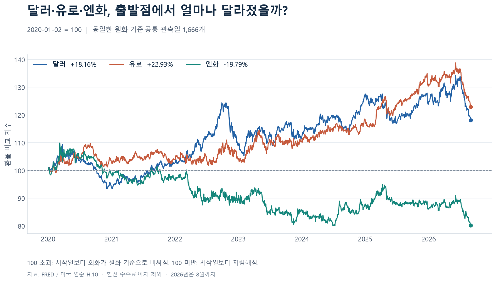
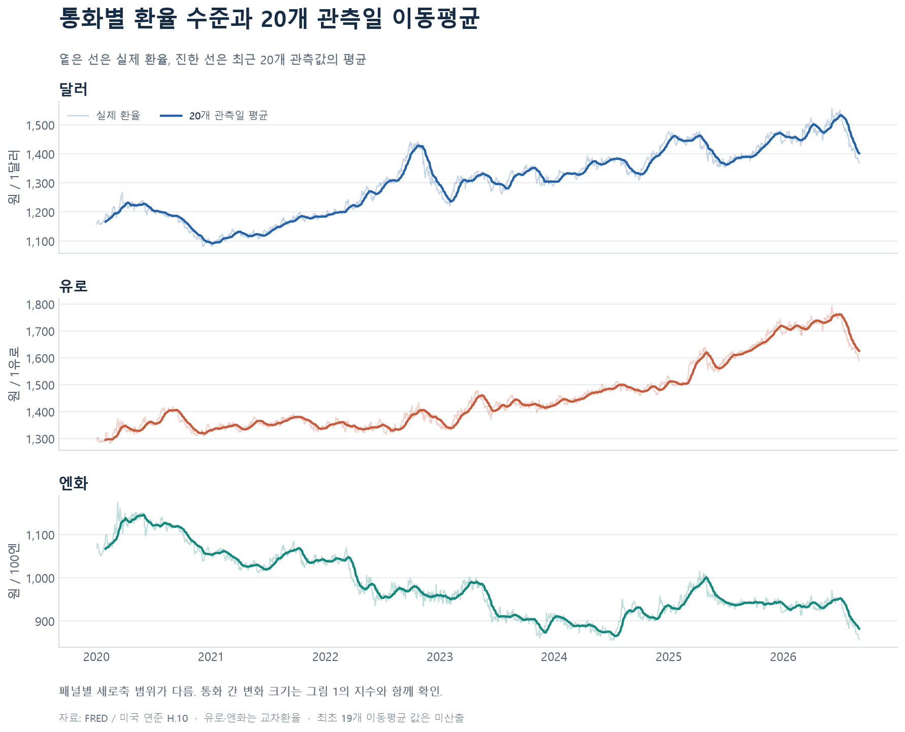
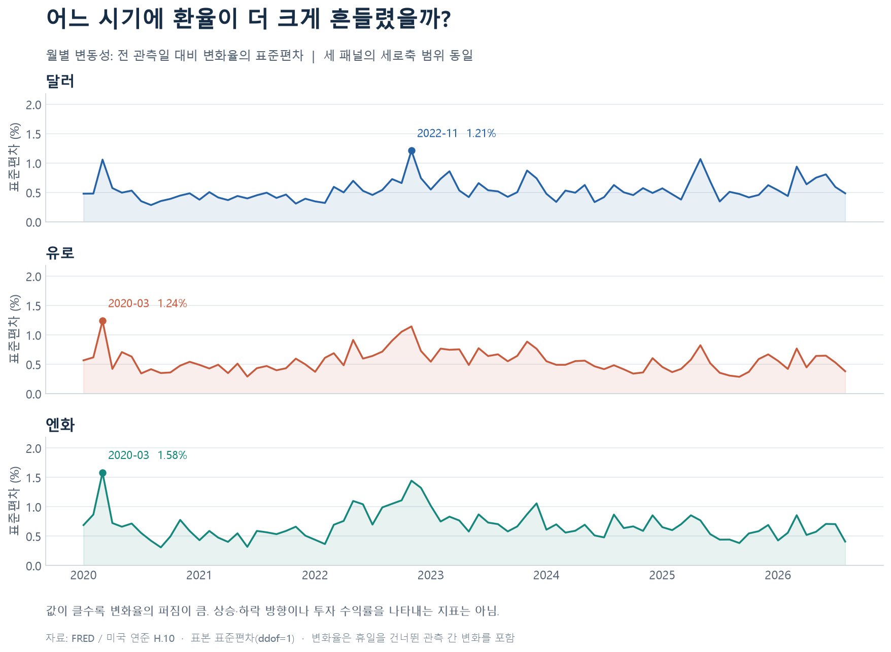

# 2020~2026년 달러·유로·엔화의 원화 기준 환율 비교

**추세와 변동성 분석 · 2026년 8월까지**

요청 기간은 2020-01-01~2026-08-31이며 실제 공통 관측 기간은 2020-01-02~2026-08-31이다. 세 통화의 동일한 1,666개 관측일을 분석했다.

## 1. 분석 주제와 선정 이유

외화를 마련하거나 해외자산의 원화 가치를 이해하려면 환율의 방향뿐 아니라 변화의 크기와 흔들림도 알아야 한다. 같은 기간에 달러·유로·엔화의 원화 가격이 어떻게 달라졌는지 비교해 경제지표를 읽는 기초를 공부하고자 했다.

이 분석은 환율 수준, 시작일 대비 변화율, 이동평균, 변화율 표준편차를 활용한다. 과거 가격의 흐름과 환전 비용의 변화를 해석하며, 향후 가격의 예측이나 매수 시점 판단은 수행하지 않았다.

## 2. 분석 질문

1. 전체 기간에 달러·유로·엔화의 원화 가격은 각각 얼마나 변했는가?
2. 세 통화의 상승·하락 흐름은 어느 구간에서 비슷하거나 달랐는가?
3. 어느 통화가 어느 시기에 가장 크게 흔들렸는가?

## 3. 데이터 설명과 출처

원출처는 미국 연방준비제도 이사회(Board of Governors of the Federal Reserve System)의 H.10 Foreign Exchange Rates이며, FRED(Federal Reserve Bank of St. Louis)를 통해 CSV로 수집했다.

| 원자료 | 단위 | 출처 |
|---|---|---|
| DEXKOUS | 1달러당 원화 | [FRED DEXKOUS](https://fred.stlouisfed.org/series/DEXKOUS) |
| DEXUSEU | 1유로당 달러 | [FRED DEXUSEU](https://fred.stlouisfed.org/series/DEXUSEU) |
| DEXJPUS | 1달러당 엔 | [FRED DEXJPUS](https://fred.stlouisfed.org/series/DEXJPUS) |

- 수집일: **2026-09-30, 한국 시간**. 정확한 UTC 수집 시각과 다운로드 URL은 [수집 기록](../data/raw/collection_metadata.json)에 보존했다.
- 빈도·관측 기준: 일별, 뉴욕 정오의 환율, 계절조정하지 않음.
- 원본 컬럼: observation_date와 해당 시리즈 값.
- 원본 데이터: 통화별 1,738행, 그중 유효한 값 1,666개, 결측 72개.
- 정제 후 컬럼: date, USD_KRW(원/1달러), EUR_KRW(원/1유로), JPY100_KRW(원/100엔).
- 데이터 이용: 해당 시리즈의 Public Domain: Citation Requested 표시에 따라 원출처, 시리즈 식별자, 수집일을 명시했다. FRED의 다른 자료에는 별도 이용 조건이 있을 수 있다.

원본 CSV는 [data/raw](../data/raw/)에 포함했다. 원자료는 사후 수정될 수 있으므로, 이번 결과의 재현에는 함께 보관한 원본을 사용한다. 국내 은행의 고객 환전율이나 국내 종가와는 기준이 다르다.

## 4. 데이터 점검과 정제 기준

### 4.1 기본 점검

세 자료 모두 날짜순으로 정렬돼 있었고, 날짜 중복·잘못된 숫자·0 이하의 환율·무한대·기간 밖의 관측값은 없었다. 원본 해시를 수집 기록과 대조해 파일 복사 과정에서 내용이 변하지 않았음을 확인했다.

### 4.2 결측치와 비관측일

세 자료의 결측 날짜 72개는 모두 같았다. 그중 69개는 pandas의 미국 연방 공휴일 달력과 일치했고, 2020-11-27·2020-12-24·2021-01-20의 원인은 미확인으로 남겼다. 공휴일 달력 일치는 원인 추정의 근거이며, 개별 결측 원인을 확정한 결과는 아니다.

요청 기간 중 주말 696개 날짜는 원본에 행 자체가 없었으며, 평일 중에서는 2020-01-01이 원본에 없었다. 이들은 원본에 행은 있지만 값이 없는 결측 72개와 구분했다.

**처리:** 원본을 그대로 보존하고 세 자료가 모두 유효한 공통 관측일만 사용했다. 결측값을 0 또는 전날 값으로 채우지 않았다. 값을 채우면 인위적인 0% 변화가 생겨 변화율의 분포와 변동성이 달라질 수 있기 때문이다. 최종 데이터는 통화별 1,666개다.

### 4.3 단위 환산

동일한 날짜의 원자료로 다음 값을 계산했다.

- 1달러당 원화 = DEXKOUS
- 1유로당 원화 = DEXKOUS × DEXUSEU
- 100엔당 원화 = DEXKOUS ÷ DEXJPUS × 100

유로·엔화의 원화 값은 계산한 교차환율이다. 엔화는 읽기 편하도록 100엔 기준으로 표시했으며, 1엔 또는 100엔 표시는 변화율 결과에 영향을 주지 않는다.

### 4.4 이상치 후보

환율 수준에 장기 추세가 있을 수 있으므로, 전 관측일 대비 변화율을 이용해 큰 변화를 검토했다. 변화율이 Q1−3×IQR 미만 또는 Q3+3×IQR 초과이면 검토 후보로 표시했다. IQR은 변화율의 75백분위 값에서 25백분위 값을 뺀 범위다.

후보는 달러 6건, 유로 2건, 엔화 6건이다. 이는 통화별 후보 건수이며, 날짜가 겹칠 수 있다. 통계적으로 크게 움직였다는 사실만으로 입력 오류를 확정할 수 없어 **후보 값은 모두 유지했다.**

자세한 기준과 제외 날짜는 [데이터 점검 기록](DATA_CHECK.md), [제외 날짜](excluded_dates.csv), [이상치 후보](outlier_candidates.csv)에 남겼다.

## 5. 분석 방법과 시각화

### 5.1 시작값 100 비교: 단위 차이를 줄여 변화 비율 보기

비교 지수 = 해당 날짜 환율 ÷ 첫 공통 관측일 환율 × 100.

2020-01-02의 각 환율을 100으로 맞췄다. 통화마다 한 단위의 가격이 다르므로, 원값만 겹쳐 그리는 대신 같은 출발점에서 변화의 비율을 비교했다. 110은 시작일 대비 10% 상승, 90은 10% 하락을 뜻한다.



| 통화 | 2020-01-02 환율 | 2026-08-31 환율 | 기간 변화율 |
|---|---:|---:|---:|
| 달러 (원/1달러) | 1,157.95 | 1,368.25 | +18.16% |
| 유로 (원/1유로) | 1,292.97 | 1,589.50 | +22.93% |
| 엔화 (원/100엔) | 1,067.92 | 856.55 | −19.79% |

기간 변화율 = (마지막 환율 ÷ 첫 환율 − 1) × 100. 이는 환율만의 변화이며 이자·수수료·세금을 반영한 투자 수익률과 다르다.

### 5.2 환율 수준과 20개 관측일 이동평균: 전체 흐름 보기

최근 20개 유효 관측값의 평균을 계산했다. 약 한 달에 해당하는 관측 구간의 흐름을 읽기 위한 선택이며, 20개의 달력 날짜와는 다르다. 일별 환율을 함께 표시해 평균이 감추는 단기 움직임도 확인할 수 있게 했다.

최초 19개 평균값은 미산출 상태로 유지했다. 이동평균은 과거 값을 반영하므로 방향 전환을 늦게 나타낼 수 있다. 미래 값이 포함되지 않는 후행 평균이다.



세 패널의 세로축 범위는 다르다. 각 통화의 흐름과 수준을 읽는 데 사용하며, 통화 간 변화 크기는 그림 1의 지수로 비교한다.

| 통화 | 기간 최솟값 | 기간 최댓값 |
|---|---|---|
| 달러 | 1,081.62원 (2021-01-04) | 1,555.96원 (2026-06-05) |
| 유로 | 1,282.26원 (2020-02-13) | 1,794.49원 (2026-06-05) |
| 엔화·100엔 | 855.39원 (2024-07-10) | 1,174.16원 (2020-03-09) |

### 5.3 월별 변동성: 변화율의 퍼짐 비교

관측 간 변화율 = (현재 환율 ÷ 전 공통 관측일 환율 − 1) × 100.

변화율이 끝난 날짜의 월로 묶어 **표본 표준편차(ddof=1)**를 계산했다. 세 통화의 단위와 수준이 다르므로 환율 원값 대신 변화율의 표준편차를 비교했다. 일별 움직임은 크지만 월말에 원래 수준으로 돌아오는 경우도 확인하기 위해 월간 변화율 대신 월 안의 관측 간 변화율을 사용했다.



| 통화 | 전체 기간 변화율 표준편차 | 변동성 최대 월 | 해당 월 표준편차 | 해당 월 변화율 수 |
|---|---:|---|---:|---:|
| 달러 | 0.5743% | 2022-11 | 1.2119% | 20 |
| 유로 | 0.5878% | 2020-03 | 1.2408% | 22 |
| 엔화 | 0.7148% | 2020-03 | 1.5818% | 22 |

전체 기간 통계는 1,665개 변화율로 계산했다. 월별로는 80개 구간을 사용했다. 월 첫 관측일의 변화율에는 직전 월 관측일과의 변화가 포함될 수 있다. 표준편차는 연율화하지 않았다.

## 6. 인사이트

### 인사이트 1. 같은 기간에도 외화를 마련하는 원화 비용은 통화별로 달라졌다

**관찰:** 그림 1과 기간 변화율 표에서 달러는 +18.16%, 유로는 +22.93%, 엔화는 −19.79%를 기록했다. 시작일과 마지막 날을 비교하면 세 통화의 방향이 같지 않았다.

**해석:** 같은 양의 달러·유로를 마련하는 원화 비용은 시작일보다 높아졌고, 같은 양의 엔화를 마련하는 비용은 낮아졌다. 예를 들어 수수료 없이 1,000달러를 마련하는 비교용 비용은 1,157,950원에서 1,368,250원으로 210,300원 증가한다.

**한계와 다음 확인:** 기준일을 바꾸면 변화율이 달라진다. 이 결과만으로 엔화의 저평가나 앞으로의 반등을 판단할 수 없다. 실제 환전을 고려한 비용 비교에는 은행의 고객 환전율과 수수료를 추가해야 한다.

### 인사이트 2. 시작일과 마지막 날의 차이만으로는 중간의 상승·하락을 설명할 수 없다

**관찰:** 그림 2에서 달러와 유로의 기간 최고값은 모두 2026-06-05에 나타났다. 달러는 1,555.96원에서 8월 말 1,368.25원으로 **최고값 대비 12.06% 하락**, 유로는 1,794.49원에서 1,589.50원으로 **11.42% 하락**했다. 그런데 시작일 대비로는 여전히 각각 +18.16%, +22.93%였다.

**해석:** 동일한 마지막 날도 비교 기준에 따라 '시작일보다 상승한 상태'와 '기간 고점보다 하락한 상태'를 동시에 나타낼 수 있다. 장기 변화율과 최근 흐름을 함께 봐야 기간 안의 경로를 설명할 수 있다. 이동평균은 이 경로를 부드럽게 보여주지만 방향 전환을 늦게 반영할 수 있다.

**한계와 다음 확인:** 고점이 같은 날짜였다는 사실만으로 두 통화의 원인을 확정할 수 없다. 유로 환산값에도 원/달러 값이 포함돼 원화 측 움직임을 공유한다. 최근 방향을 더 구체적으로 비교하려면 같은 길이의 최근 구간 변화율과 다른 이동평균 구간을 추가로 확인할 수 있다.

**비교 날짜를 정한 이유:** 장기 변화는 분석 시작일인 2020-01-02와 마지막 날인 2026-08-31을 비교했다. 중간의 상승·하락 경로는 기간 안에서 확인된 고점과 마지막 날을 비교했다. 같은 통화를 두 관점에서 읽기 위한 기준이며, 고점은 사후에 확인한 값이다. 앞으로 최근 흐름을 관찰할 때는 1개월·3개월처럼 기간을 먼저 정하고 같은 기준을 유지할 수 있다. 이 리포트에서는 최근 1개월·3개월 변화율을 별도로 계산하지 않았다.

### 인사이트 3. 기간 전체에서 하락한 통화도 관측 간 움직임은 클 수 있다

**관찰:** 엔화의 전체 기간 변화율은 −19.79%였으나, 관측 간 변화율의 표준편차는 **0.7148%**로 달러 0.5743%, 유로 0.5878%보다 컸다. 그림 3의 월별 최고 변동성은 엔화·유로가 2020년 3월, 달러가 2022년 11월로 서로 달랐다.

**해석:** 시작일 대비 가격의 방향과 중간의 흔들림은 서로 다른 정보를 제공한다. 기간 전체로 가격이 낮아졌다는 사실이 매 관측일에 조금씩 안정적으로 하락했다는 뜻은 아니다. 평균적인 변화의 퍼짐을 보여주는 표준편차를 함께 보면, 순변화율만으로 드러나지 않는 움직임을 확인할 수 있다.

**한계와 다음 확인:** 표준편차는 상승·하락 방향이나 최대 손실을 직접 측정하지 않는다. 주말·휴일을 건너뛴 변화가 포함되고, 평균적인 퍼짐만 요약한다. 원인 조사가 필요하면 변동성 최대 월의 개별 날짜와 당시 공식 정책 발표·시장 자료를 대조해야 한다. 본 리포트에서는 특정 사건을 원인으로 확정하지 않았다.

## 7. 결론

2020년 첫 공통 관측일부터 2026년 8월 말까지 달러·유로는 원화 기준 가격이 상승했고 엔화는 하락했다. 그러나 기간 변화율 하나로 각 통화의 중간 경로와 흔들림을 설명할 수는 없었다.

이번 분석에서 시작값 100 지수는 통화별 변화의 비율, 환율과 이동평균은 수준과 흐름, 변화율 표준편차는 흔들림의 크기를 보여줬다. 환율을 읽을 때는 **기준 시점·단위·변화 방향·변동성**을 함께 확인해야 한다.

## 8. 한계

1. **2026년은 일부 기간:** 1~8월 자료를 사용했고, 연도 전체 결과로 일반화하지 않았다.
2. **관측 기준 차이:** 뉴욕 정오 기준이며 국내 고객 환전율·종가·수수료는 반영하지 않았다.
3. **결측치와 시간 간격:** 공통 유효 관측일을 사용해 주말·휴일을 건너뛴 변화가 포함된다. 공휴일과 일치하지 않는 결측 날짜 3개의 원인은 미확인이다.
4. **기준일 민감성:** 시작값 100 지수와 기간 변화율은 선택한 시작일에 영향을 받는다.
5. **외부 변수와 인과:** 금리·물가·정책·자금 흐름 등을 함께 분석하지 않아 가격 움직임의 원인을 확정할 수 없다.
6. **공통 원화 기준:** 세 환율은 원화 측 움직임을 공유한다. 계산한 유로·엔화 교차환율을 독립적인 통화 움직임으로 가정하지 않는다.
7. **지표의 한계:** 이동평균의 지연과 표준편차의 요약 특성이 있다. 정기적으로 반복되는 계절성이 있는지는 검증하지 않았다. 단기 변동이 모두 의미 없는 노이즈라고 가정하지도 않았다.
8. **과거 자료:** 미래 환율이나 투자 성과는 평가하지 않았으며, 이자·세금 등을 포함한 투자 수익률을 계산하지 않았다.

## 9. 실행 방법과 재현성

프로젝트 폴더 M1-1에서 다음 순서로 실행한다. Python 버전과 글꼴 조건은 [README](../README.md), 라이브러리 버전은 [requirements.txt](../requirements.txt)를 참고한다.

```console
python -m pip install -r requirements.txt
python check_data.py
python analysis.py
python verify_analysis.py
```

보관한 원본을 사용하면 분석 실행에 인터넷이 필요하지 않다. 새 원본 수집이 필요할 때만 `python collect_data.py`를 실행한다. 새로 수집하면 자료 수정 때문에 결과가 달라질 수 있다.

분석용 CSV는 소수 열 자리, 파생 계산 CSV는 소수 여덟 자리까지 보존하고, 리포트의 환율·기간 변화율은 소수 둘째 자리로 표시했다. 첫 변화율과 첫 19개 이동평균은 계산할 수 없는 값으로 유지했다.

독립 검산 프로그램은 pandas·numpy를 사용하지 않고 원본을 다시 읽어 Decimal 계산과 statistics.stdev로 환산·지수·변화율·이동평균·월별 표준편차를 대조한다. 실행 결과는 [verification.json](verification.json)에 남긴다.

## 10. AI 사용 로그

| 사용 작업 | 사용 이유 | 검증 방법 |
|---|---|---|
| 데이터 출처·수집 코드 탐색 | 공식 자료와 재현 가능한 수집 방법을 찾기 위해 | 공식 시리즈 페이지의 출처·단위·관측 기준 확인, 실제 수집 결과와 원본 해시 보존 |
| 데이터 점검·환산 코드 작성 | 날짜·결측치·단위 계산을 일관되게 처리하기 위해 | 원본 읽기, 통화별 결측 날짜 대조, 독립 Decimal 계산으로 환산값 확인 |
| 분석 계산·그래프 코드 작성 | 동일한 방법으로 세 통화를 비교하기 위해 | 독립 검산 코드, 원본 기반 계산값과 파생 CSV·요약 수치 대조, 이미지의 축·글꼴·범례 확인 |
| 인사이트·문장 초안 작성 | 관찰과 해석을 구분하고 설명을 정리하기 위해 | 수치·날짜를 분석 결과와 대조, 확인되지 않은 원인과 미래 전망은 결론에서 제외 |
| 환율 관측 태도·투자 공부 회고 초안 작성 | 분석 결과를 경제지표 관찰과 투자 판단의 질문으로 연결하기 위해 | 한국은행·미국 SEC 투자자 교육 자료 확인, 세 인사이트의 수치 대조, 가상 수익률 예시 계산과 분석 종료일 명시 |

도구는 Codex의 AI 지원을 사용했다. 사용자는 주제·통화·기간을 결정하고 데이터 수집 프로그램을 실행했다. 코드와 해석 초안은 AI가 지원했으며, 최종 제출 전에 사용자가 해석과 한계를 읽고 본인의 말로 설명하는 검토가 필요하다. 사용자 검토를 이미 완료한 것으로 기록하지 않았다.

## 11. 관련 파일

- [데이터 점검·정제 기록](DATA_CHECK.md)
- [분석 수치·그래프 설명](ANALYSIS_NOTES.md)
- [작업 체크리스트](WORKLIST.md)
- [분석 요약 JSON](analysis_summary.json)
- [정제 데이터](fx_krw_clean.csv)
- [월별 변동성](monthly_volatility.csv)
- [제출 안내와 설명 연습](SUBMISSION.md)

## 12. 환율을 관측하는 태도와 투자 공부에 남길 회고

### 12.1 세 인사이트에서 가져갈 관측 원칙

이번 분석에서 남길 교훈은 **환율의 방향을 단정하기 전에, 비교 기준과 내 돈에 미치는 영향을 확인하는 습관**이다. 세 인사이트를 실제 관측 태도로 연결하면 다음과 같다.

| 분석에서 확인한 사실 | 앞으로 관측할 때의 태도 | 투자·환전 전에 던질 질문 |
|---|---|---|
| 달러 +18.16%, 유로 +22.93%, 엔화 −19.79%로 기간 변화 방향이 달랐다. | 원/달러만으로 모든 외화의 흐름을 대표하지 않는다. 필요한 통화의 원화 가격을 따로 본다. | 내가 지출하거나 보유할 자산은 어느 통화에 영향을 받는가? |
| 달러·유로는 시작일보다 올랐지만, 기간 고점에서는 각각 12.06%·11.42% 내려왔다. | ‘올랐다·내렸다’는 표현에 비교 날짜를 붙인다. 장기 변화와 최근 흐름을 함께 본다. | 내 매입 환율과 비교하면 어떤가? 고점 대비 하락만 보고 싸다고 판단하고 있지는 않은가? |
| 기간 전체로 하락한 엔화의 변화율 표준편차가 세 통화 중 가장 컸다. | 낮아진 가격을 낮은 위험으로 받아들이지 않는다. 방향과 변동성을 따로 확인한다. | 사용 시점까지 더 내려가거나 크게 흔들려도 계획을 유지할 수 있는가? |

엔화가 시작일보다 낮아졌다는 결과만으로 지금 매수하면 반등할 것이라고 결론 내릴 수 없다. 이동평균 역시 흐름을 읽는 보조 지표이며, 이번 분석에서는 매매 신호의 성과를 검증하지 않았다.

‘비교 기준을 적는다’는 말은 **환율이 올랐거나 내렸다고 말할 때, 어느 날짜와 비교했는지 함께 적는다**는 뜻이다. 오래전부터의 변화가 궁금하면 분석 시작일, 최근 흐름이 궁금하면 미리 정한 최근 구간의 시작일, 내 환전 비용이 궁금하면 실제 환전일과 환전율을 기준으로 잡을 수 있다. 서로 다른 통화를 비교할 때는 시작일과 종료일을 동일하게 맞춘다.

### 12.2 국내 경제지표 속에서 함께 살필 것

환율은 두 통화의 상대 가격이다. 따라서 원/달러 상승을 곧바로 ‘한국 경제 전체의 악화’로 해석하기보다, 원화 측 요인과 상대 통화 측 요인을 함께 점검해야 한다. 한국은행은 환율이 외환 수요·공급에 의해 결정되며 물가·생산성, 대외거래·통화정책, 시장 기대와 뉴스 등 여러 요인의 영향을 받는다고 설명한다. [한국은행 「환율」](https://www.bok.or.kr/portal/main/contents.do?menuNo=200407)

앞으로 국내 경제를 관찰할 때는 다음 항목을 함께 기록하는 방법을 제안한다. 이는 이번 데이터에서 검증한 원인 목록이 아니라 **추가로 확인할 가설을 만드는 관찰 계획**이다.

- **금리·정책:** 한국과 해당 통화권의 정책금리 및 공식 발표를 비교한다. 금리 차이 하나만으로 환율 방향을 확정하지 않는다.
- **물가·수입 비용:** 소비자물가와 수입물가를 함께 본다. 환율 상승이 수입 비용에 부담을 주는지 살핀다.
- **수출입·국제수지:** 수출입과 경상수지, 금융계정의 자금 흐름을 함께 확인한다. 외화를 벌어들이는 흐름과 해외로 투자하는 흐름이 어떻게 달라지는지 질문한다.

환율 상승은 수입 원자재와 외화 차입금의 원화 부담을 높일 수 있고, 수출에는 다른 영향을 줄 수 있다. 따라서 국내 경제에 미치는 영향을 볼 때도 업종·기업·가계의 외화 지출과 수입 구조를 구분할 필요가 있다. [한국은행 「환율이란 무엇인가요?」](https://www.bok.or.kr/portal/bbs/B0000273/view.do?menuNo=700805&nttId=10056517)

관찰 기록에는 지표의 **대상 기간과 발표일**을 함께 적는다. 일별 환율과 월별 경제지표를 연결할 때 시간 기준이 다르기 때문이다. 지표 값은 [한국은행 경제통계시스템(ECOS)](https://ecos.bok.or.kr/)과 각 기관의 공식 발표로 확인한다.

본 분석은 **2026-08-31까지**다. 보고서 작성일인 2026-10-01의 시장 상황이나 이후 환율 방향을 판단하려면 종료일 이후 환율과 최신 경제지표를 별도로 갱신해야 한다. 이 절은 현재 수치를 진단한 결과가 아니라, 앞으로 경제지표를 읽는 기준을 정리한 것이다.

### 12.3 투자 관점: 자산의 성과와 환율의 영향을 함께 계산하기

해외자산 투자에서는 현지 통화로 표시한 자산 수익과 원화로 환산한 수익이 다를 수 있다. 환율 변화는 해외투자 수익을 높이거나 낮출 수 있다. [미국 SEC Investor.gov 「International Investing」](https://www.investor.gov/introduction-investing/investing-basics/investment-products/international-investing)

같은 외화로 매수·매도하는 단일 자산을 중간 입출금·배당 없이 보유하고 환헤지를 하지 않은 단순한 경우, 비용·세금 제외 원화 수익률은 다음과 같다.

```text
원화 수익률 = (1 + 외화 기준 자산 수익률) × (1 + 원/외화 환율 변화율) − 1
```

**가상 예시:** 달러 기준 자산 가격이 10% 올라도 같은 기간 원/달러가 10% 내리면, 원화 기준 수익률은 `1.10 × 0.90 − 1 = −1%`다. 실제 거래 사례나 예측이 아닌 계산 예시이며, 환율 변화율은 해당 자산의 매입·매도 시점을 기준으로 계산한다. 단순히 두 변화율을 더하면 교차 효과를 빠뜨린다.

이 때문에 해외투자를 공부할 때는 자산 전망에 더해 **보유 목적, 필요한 시점, 원화 기준 손익, 환전 수수료, 상품의 환헤지 여부**를 확인하는 태도가 필요하다. 특정 통화가 과거에 올랐거나 내렸다는 이유만으로 매수 대상을 정하지 않는다.

여행비·학비처럼 외화를 사용할 일정이 정해져 있다면, 그 일정에 맞춰 환전 금액과 시점을 나누는 계획도 검토할 수 있다. 이는 한 번의 환율에 전체 비용이 좌우되는 정도를 줄이려는 방법이며, 한 번에 환전하는 것보다 비용이 낮아진다고 보장하지 않는다. 투자용 자금은 별도로 보유 기간과 감당할 수 있는 원화 손실을 먼저 정하는 것이 이번 분석에서 제안하는 실천 원칙이다.

### 12.4 마지막에 남길 문장

이번 분석의 세 인사이트는 같은 통화도 기준일에 따라 다르게 보이고, 가격의 방향과 흔들림은 서로 다른 정보를 준다는 점을 보여준다. 앞으로는 ‘환율이 얼마인가’에 더해 ‘언제와 비교했는가’, ‘어떤 경제지표와 함께 움직였는가’, ‘내 지출과 투자에는 어떤 영향을 주는가’를 묻는 태도를 가져가고자 한다. 관찰한 숫자와 가능한 원인을 구분하고, 확인되지 않은 전망은 가설로 남겨두는 습관이 데이터 분석과 재테크 공부를 연결하는 출발점이다.

보고서 작성일 및 회고 참고 자료 확인일: 2026-10-01, 한국 시간. 회고는 사용자 검토를 위한 초안이다.
